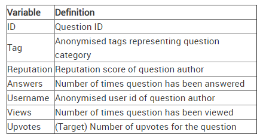

# Number Of Upvotes Prediction

An Analytics Vidhya [Hackathon](https://datahack.analyticsvidhya.com/contest/enigma-codefest-machine-learning-1/) Problem

# Problem Statement
An online question and answer platform has hired you as a data scientist to identify the best question authors on the platform. This identification will bring more insight into increasing the user engagement. Given the tag of the question, number of views received, number of answers, username and reputation of the question author, the problem requires you to predict the upvote count that the question will receive.

**The structure of the dataset is as follows:**

**Evaluation Metric**: Root Mean Squared Error (RMSE)
 
# Method 1
I participated in this hackathon to explore the use of Categorical Embeddings in structured data problems. **Categorical Embeddings** take a categorical attribute and study the relationship of the levels in that attribute wrt target and all other attributes and return a vector representation of d-dimensions (d can be defined by the user). This vector encodes the relationship between that categorical attribute and every other attribute which is the primary motivation of using this method here. In the absence of this, our best bet is either one-hot encoding (which fails to capture the distances between different levels in a category and gives everyone equal weightage) or label encoding which could only be used for ordinal categorical variables and not where there's no inherent ordering or hierarchy.

The notebook **Prediction_Number_Of_Upvotes.ipynb** uses categorical embeddings to predict the number of upvotes. Although I expected it to perform well, it couldn't surpass traditional ML methods. Possible reasons could be lack of training data for the MLP or the fact that DL methods generally tend to not do as good as ML methods in case of structured data.

# Method 2
I tried to build three models i.e. Linear Regression, Decision Trees and Random Forest Regression in order to predict the number of upvotes. 

A feature called threshold was engineered which measured how well the answers were received (Precisely speaking, I used 70% quantile). 

I tried to *cap the outliers which were over 90 percentile of the data to the 90th percentile value* but it didn't help. 

Then I *eliminated extreme outliers from the "Views"* column which helped better the evaluation metric.

The *least obtained rmse* was **1088** for which *Random Forest Regressor* was used with 10 as the max depth and 25 as the number of estimators in the tree.
